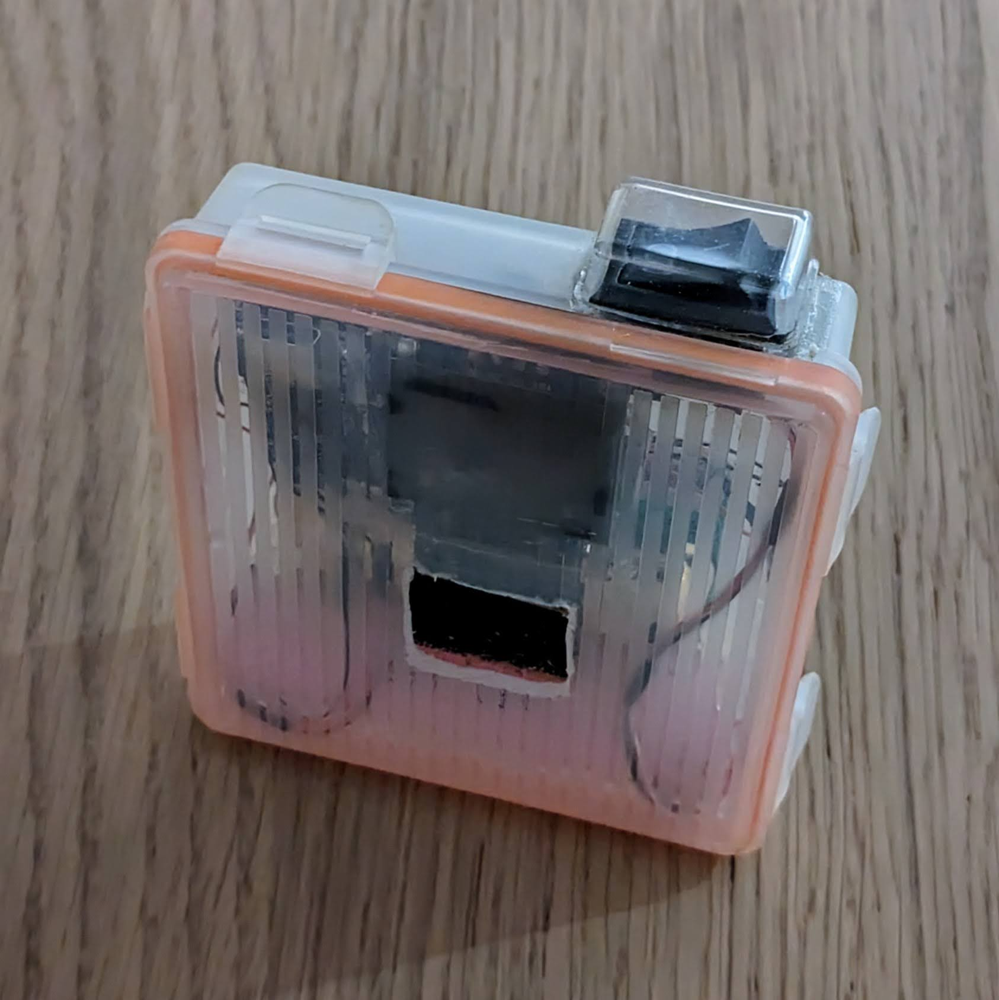
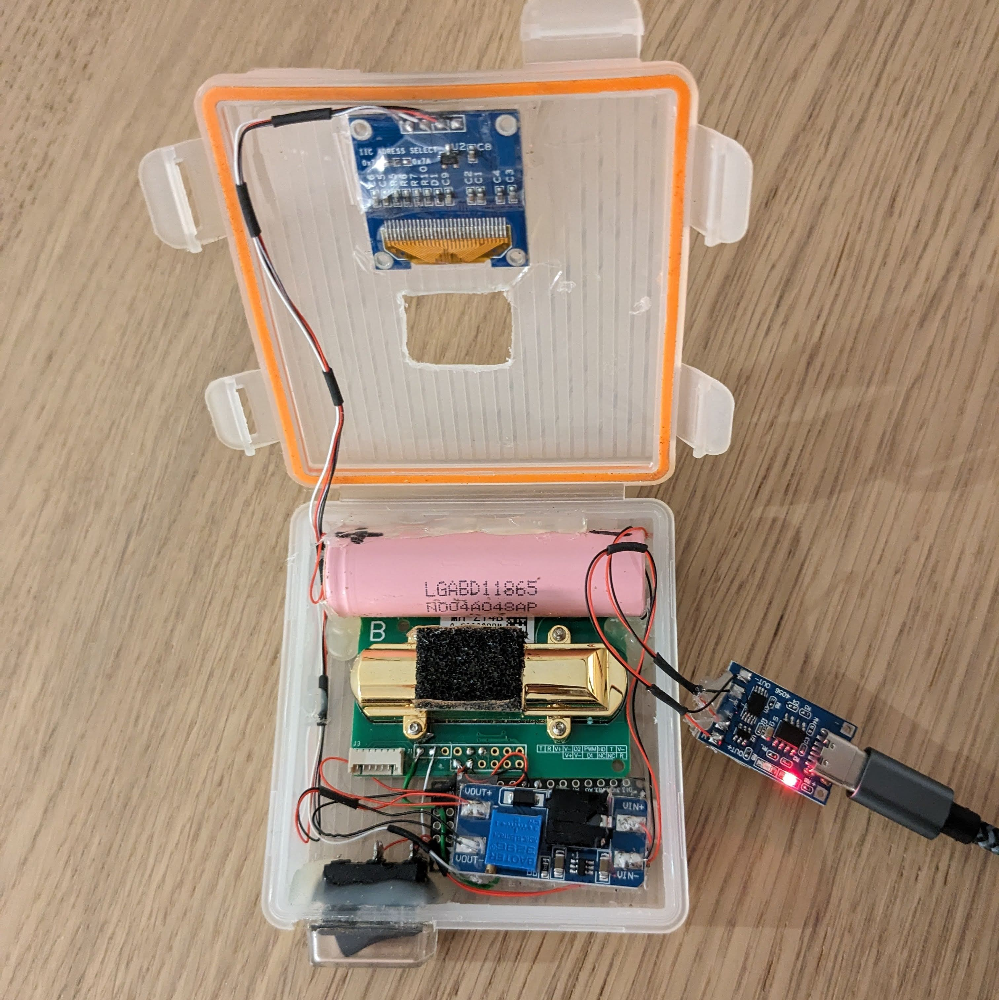
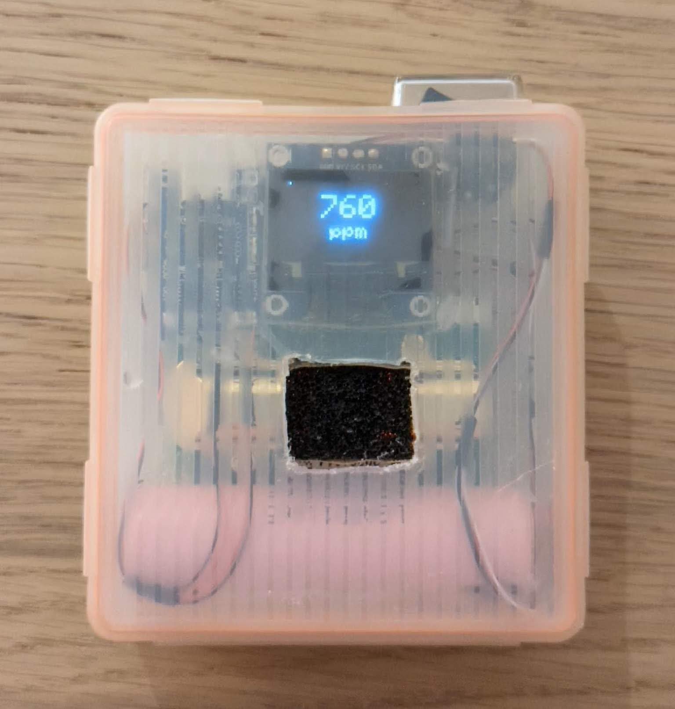
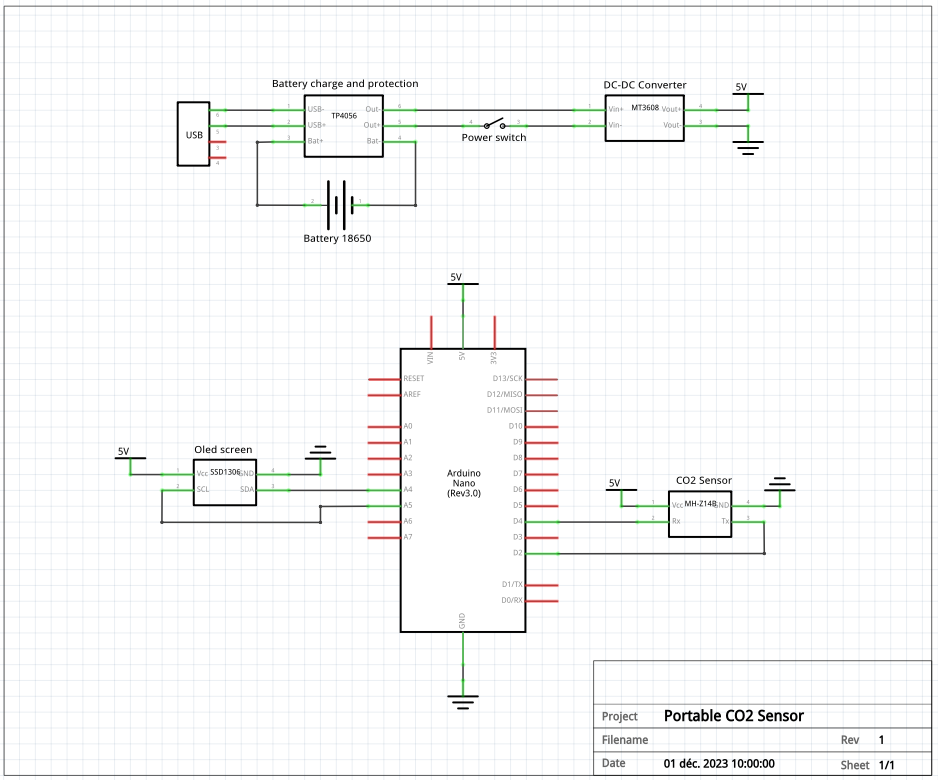

# Caving CO2 sensor

A DIY portable C02 sensor 0-50000ppm (5%). Build around the [MH-Z14B](https://www.winsen-sensor.com/d/files/infrared-gas-sensor/mh-z14b-co2-manual(ver1_1).pdf) NDIR CO2 sensor from [Wisen](https://www.winsen-sensor.com/product/mh-z14b.html)

Designed for use during caving to verify that it is safe to go deeper, as CO2 can build up at the bottom of some caves due to various factors.

## Building it

### Parts list:

- *32€* [MH-Z14B](https://aliexpress.com/item/1005005912491645.html) CO2 Sensor (The default shipped range is only 5000ppm. **You must specify that you want the 50000ppm range when ordering**)
- *3€* Arduino Nano
- *2€* [SSD1306](https://aliexpress.com/item/1005005281256695.html) 0.96 inch Oled Screen 128x64
- *2€* [MT3608](https://aliexpress.com/item/1005005764995266.html) DC-DC step up converter to 5V
- *3€* [TP4056](https://aliexpress.com/item/1005005865606098.html) Battery charging and protection circuit
- *2€* 18650 Lithium Battery
- *1€* Power switch ([like this one](https://www.aliexpress.com/item/32874899036.html))
- *4€* Case ([like this one](https://www.aliexpress.com/item/4001139639491.html))

Total: **~50€**

### Schematics

### Programmation

The Arduino communicates to the sensor via UART using the [MH-Z-CO2-Sensors library](https://github.com/tobiasschuerg/MH-Z-CO2-Sensors)

[VSCode](https://code.visualstudio.com/) and [Platformio](https://platformio.org/) are used for development, building and dependency management: [Getting started](https://docs.platformio.org/en/stable/integration/ide/vscode.html)

## Working state

At boot a loading bar is displayed as the sensor need arround 20-30 seconds before we can read a meaningfull value from it.

Then a new value is read every 4 seconds. There is a small indicator at the top left to indicate that the device is still alive. It is best to leave the device on for a few minutes so that the value stabilizes.

A battery charge should provide at least 5 hours of reading

## Limitations

**This is not an accurate device** it should be used **for informational purposes only**. Its reading value has not been verified against other accurate CO2 sensors

The sensor datasheet states an accuracy of 50 ppm + 5% of the reading value. Operating conditions range from -10°C to 50°C and 0 to 95% relative humidity without condensation.

The datasheet also states that it should be calibrated at least every 6 months by placing the sensor in a reference environment at 400ppm for 20 min and triggering the calibration function.

## Improvements and ideas

- Led and/or alarm when high concentration is detected
- Retain the max seen CO2 value
- Button to trigger the sensor calibration
- Long term data logging

## CO2 and human physiology

- **450 ppm 0.04%**: Normal concentration in air outside
- **1000 ppm 0.01%**: Normal concentration in air inside
- **5000 ppm 0.5%**: OSHA Standard limit for and averaged 8 hours workday
- **30 000 ppm 3%**: Mild respiratory stimulation, headaches, dizziness, fatigue
- **50 000 ppm 5%**: Exaggerated respiratory response, severe headache and fatigue. Prolonged exposure results in irreversible effects to health.

The duration of exposure plays an important role. The level of tolerance can also differ significantly between cavers.

More information:
- https://en.wikipedia.org/wiki/Carbon_dioxide#Human_physiology
- https://en.wikipedia.org/wiki/Hypercapnia

## Similar product and projects

- [Bosean BH-90A](https://www.alibaba.com/product-detail/Bosean-CO-EX-O2-H2S-H2_1600106393677.html) (commercial product)
- https://ihormelnyk.com/Page/mh-z19_co2_meter
- https://diyi0t.com/mh-z14a-co2-meter-arduino-esp8266-esp32/
